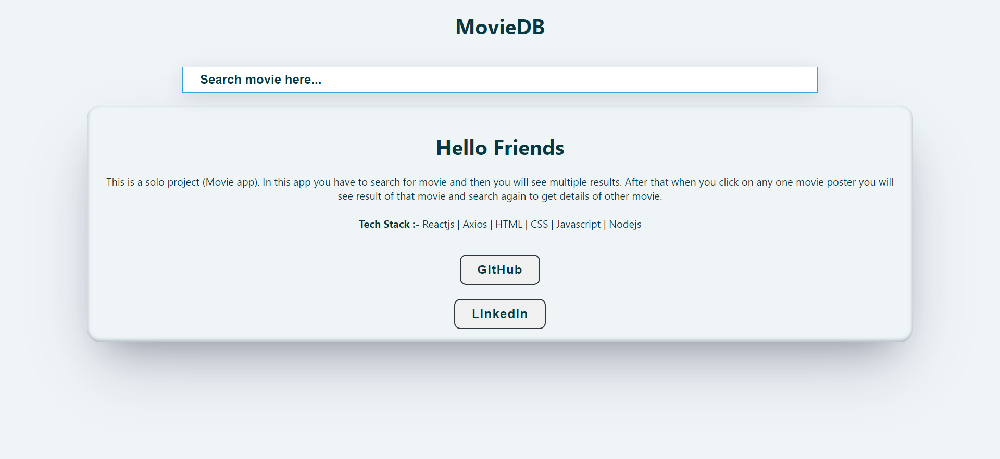
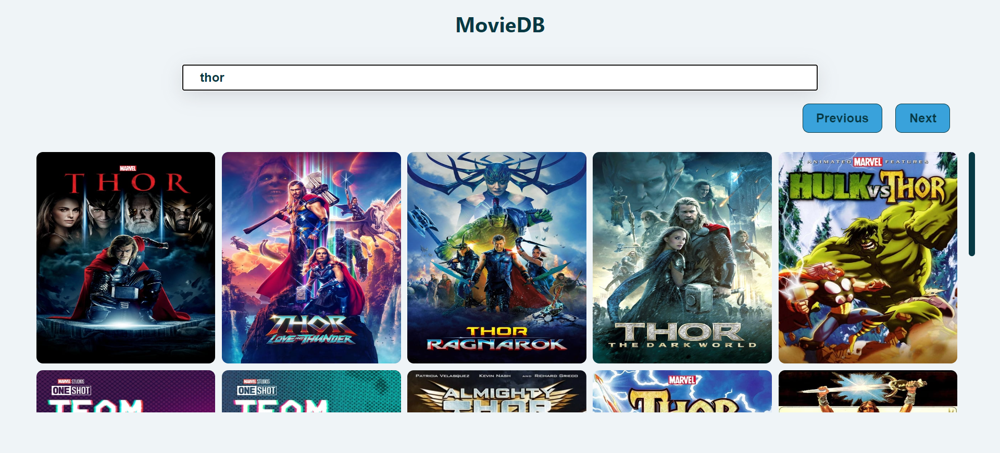
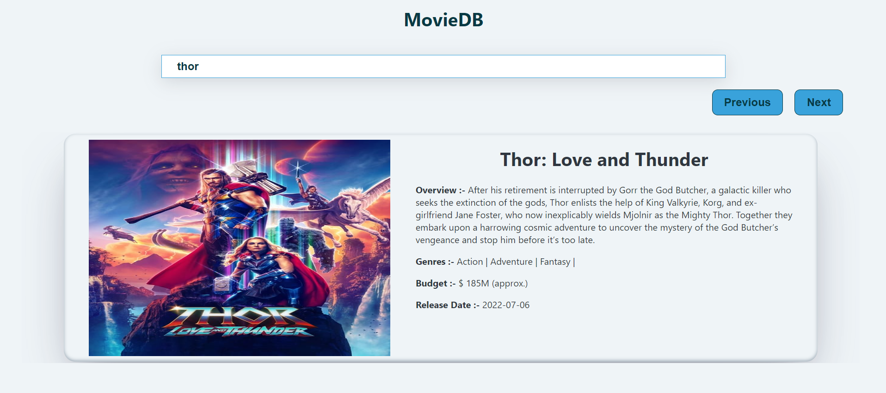

# Movie App
<br />

# About the Website


### This is a solo react web application. In this web application you can search for any movie you want. After search you will see alot of results when you click anyone of the reasult you will see details of that movie. Currently you will see name of the movie, overview, budget, release date. This is just to demo project.
<hr/>

## Data Source for Covid-19
* [data source](https://developers.themoviedb.org/3/getting-started/introduction)
<hr/>

## Steps to run application on local server

* Clone this repository locally than to following for starting local server for backend or frontend.
  
 * <kbd>npm run dev</kbd> ==> This is the main react application after opening that folder you will see all files related to application. To start application on local server you have to run this command in terminal. Firstly you have to install npm package by npm install. 
<hr/>

## TechStacks
* React
* NodeJS
* JavaScript
* CSS
* Media Query
* HTML
* Vercel
<hr/>

## Deployed Link

```bash
  https://deepu2560-movie-app.vercel.app
```


# Features

* ##  Home page


* ##  Search


* ##  Movie Details


<hr />
Thank you ❤️
